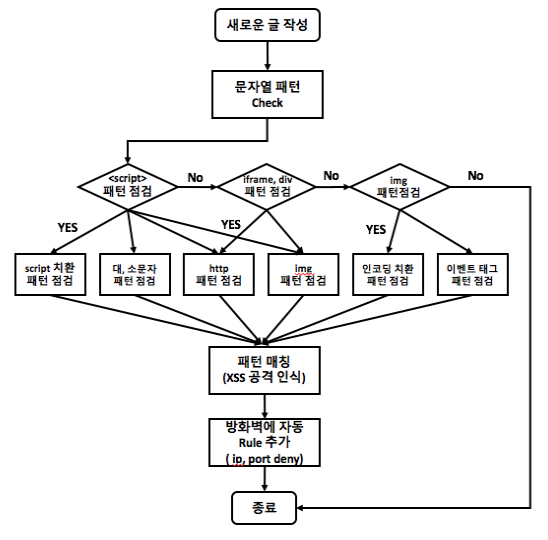

# 크로스 사이트 스크립팅 (XSS) 공격 패턴 분석 및 방어

## 1. 환경설정
* OS : Linux Ubuntu 14.04
* language : html 5, php7.1
* Dabatase : MySQL 5.7

## 2. 시나리오
1. XSS 공격 인식을 위해 패턴 매칭 방법을 추가하여 공격을 인식한다.
2. 기존의 나와있는 XSS공격들의 패턴들을 분석 후 공격 패턴에 대한 조건 문을 추가한다.
3. 각 패턴과 일치하는 글이 올라오면 자동으로 XSS 공격을 인지하고 게시글을 차단한다.
4. 보안을 위해 서버에 방화벽을 작동시켜 공격이 인식하면 공격자 IP를 차단하는 Rule이 생성되고 방화벽에 적용한다.

## 3. 알고리즘

## 4. 데모영상
* https://www.youtube.com/watch?v=2oKTHdCzEYs
