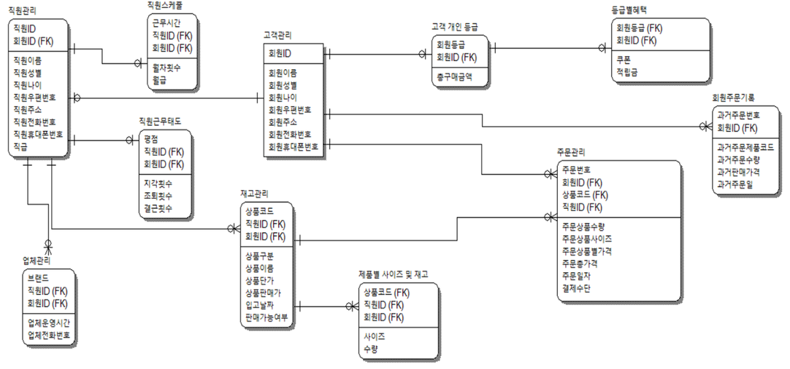
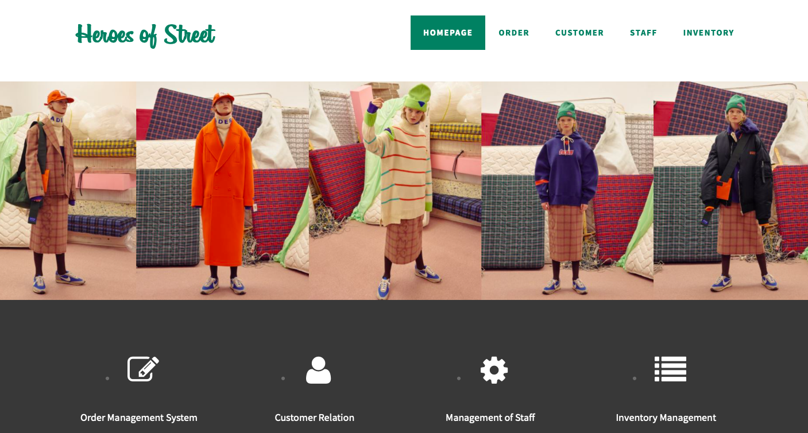

# 쇼핑몰 데이터베이스 구축 및 관리

## 1. 환경설정
* language : html 5, php7.1
* database : Solaris/Oracle 11.2.0

## 2. 시나리오
1. 쇼핑몰에서 사용 가능한 홈페이지 제작
2. 매장 전체를 관리 (직원관리, 고객관리, 재고관리, 주문관리)

## 3. DB 모델링

## 4. 홈페이지

