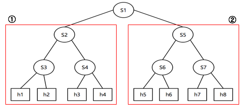
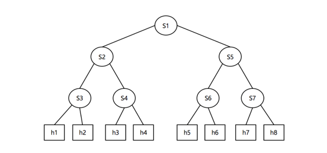

# SDN Control with two controllers (onos, pox)

## 1. 환경설정
* OS : Linux Ubuntu 14.04
* language : python 2.7.10, shell script

## 2. 시나리오
1. Mininet을 이용한 SDN 구성
2. ONOS Controller 를 이용해 SDN을 Control 
3. Flow Rule을 추가하여 네트워크 흐름 변화 확인
4. POX Controller 를 이용해 SDN을 Control
5. Firewall Rule을 추가하여 네트워크 흐름 변화 확인
6. Python GUI를 통한 동작 Control

## 3. ONOS Controller Execution

1. Layer-2의 네트워크 토폴리지 구성
2. h1 ~ h8 에 대해 Ping Test
3. S2 & S5 에 Flow Rule을 추가하여 네트워크 연결 차단
4. ① 과 ② 영역을 나누어 확인 (Flow Rule에 의해 ① -> ② 또는 ② -> ①  ping 전송 불가)

~~~
ONOS Controller Connect
$ export ONOS_ROOT=~/onos
$ source $ONOS_ROOT/tools/dev/bash_profile
$ export ONOS_IP=127.0.0.1
$ export ONOS_APPS=drivers,openflow,proxyarp,mobility,fwd
$ ok clean

ONOS Controller UI execution
> http://127.0.0.1:8181/onos/ui/login.html
  id : karaf
  pw : karaf

MININET execution
$ sudo python tree.py
$ pingall

Flow rule add
$ ./flow_rule.sh
$ pingall
~~~
## 4. POX Controller Execution

1. Layer-2의 네트워크 토폴리지 구성
2. h1 ~ h8 에 대해 Ping Test
3. POX 에 Firewall Rule을 추가하여 네트워크 연결 차단
4. h1 h8 , h2 -> h7 , h3 -> h6, h4 -> h5 : Block Rule 추가 (Block 에 대해선 양방향으로 차단된다.)

~~~
POX Controller Connect ( not rule )
$ ./pox/pox.py log.level --DEBUG openflow.of_01 forwarding.l2_learning

MININET execution
$ sudo python tree.py
$ pingall

POX Controller redo ( add rule )
$ ./pox/pox.py log.level --DEBUG openflow.of_01 forwarding.l2_learning misc.firewall

MININET redo
$ sudo python tree.py
$ ping all
~~~
## 4. 데모영상
* SDN - ONOS Control : https://youtu.be/-csGH1HJ79g
* SDN - POX Control : https://youtu.be/XnyvhnT98KM
