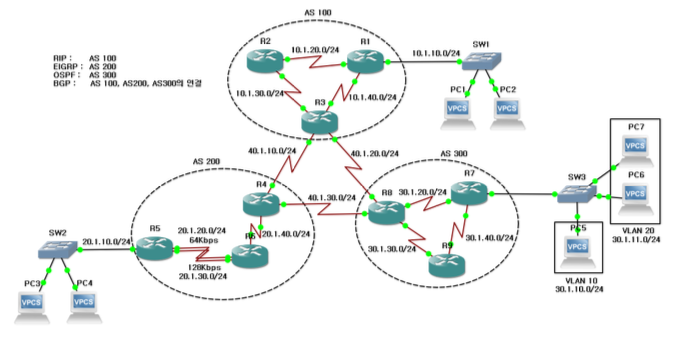
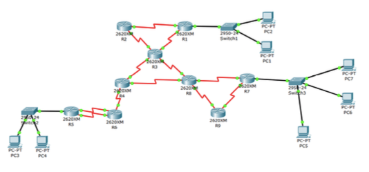

# 네트워크 토폴리지에 따른 동작 확인

## 1. 환경설정
* Emulator : Cisco Packet Tracer

## 2. 시나리오

각 설정 후 ping, traceroute 를 이용하여 패킷 흐름 확인 
1. RIP, EIGRP, OSPF 라우팅 프로토콜 동작 확인
2. Load Balancing 동작 확인
3. VLAN 동작 확인
4. External BGP, Default Routing 동작 확인
5. Access Control List 동작 확인
6. NAT, DHCP 동작 확인

## 3. 결과
file : ./reference/report.pdf 

