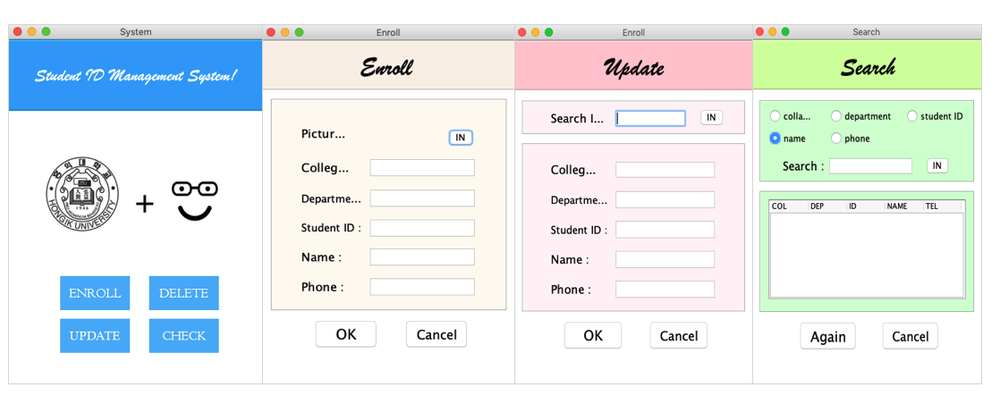

# Student card management system

## 1. 환경설정
* language : java 9.0.1
* Database : mysql 5.7

## 2. 시나리오
1. 대학교 학생들의 학생증을 관리한다.
2. Enroll, Delete, Update, Search 와 같은 기본적인 관리 기능이 있다.
3. 관리 프로그램은 GUI 화면으로 구성한다.

## 3. GUI 화면

